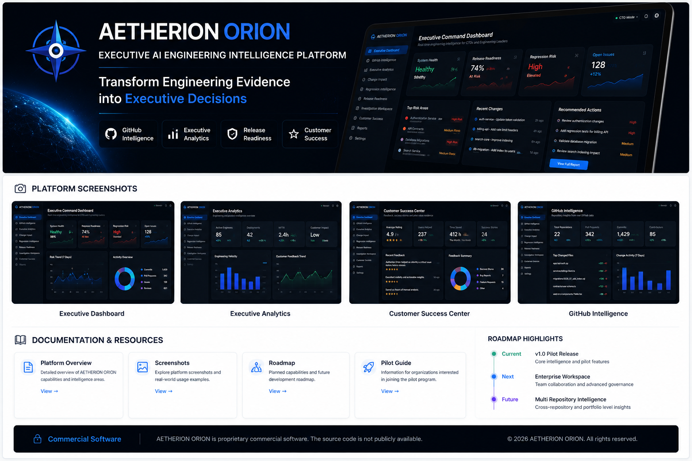
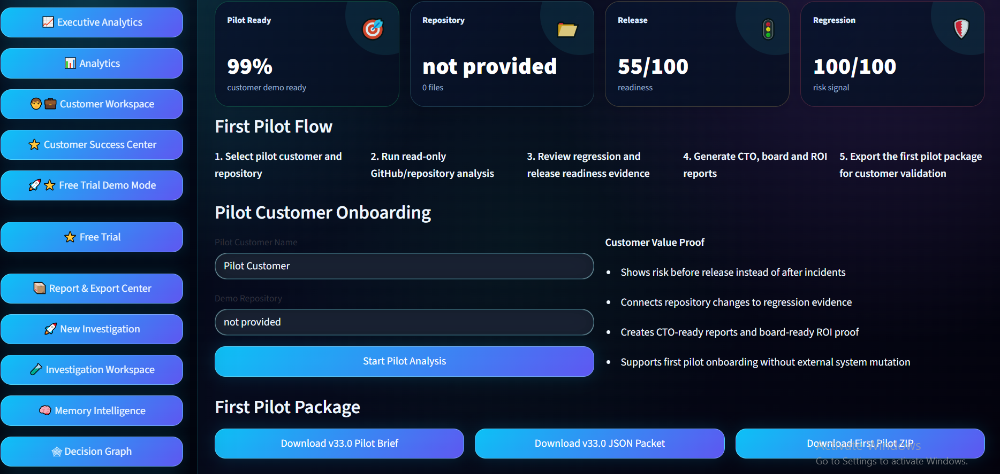
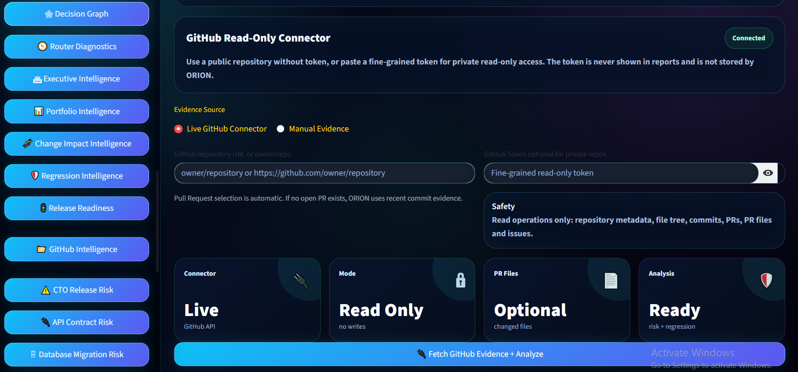
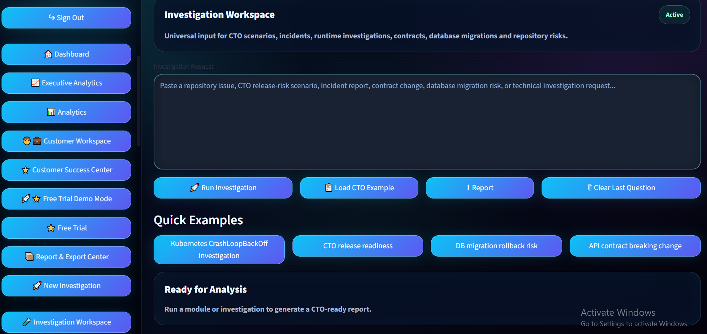
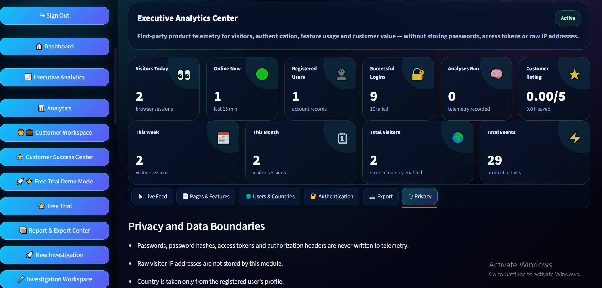
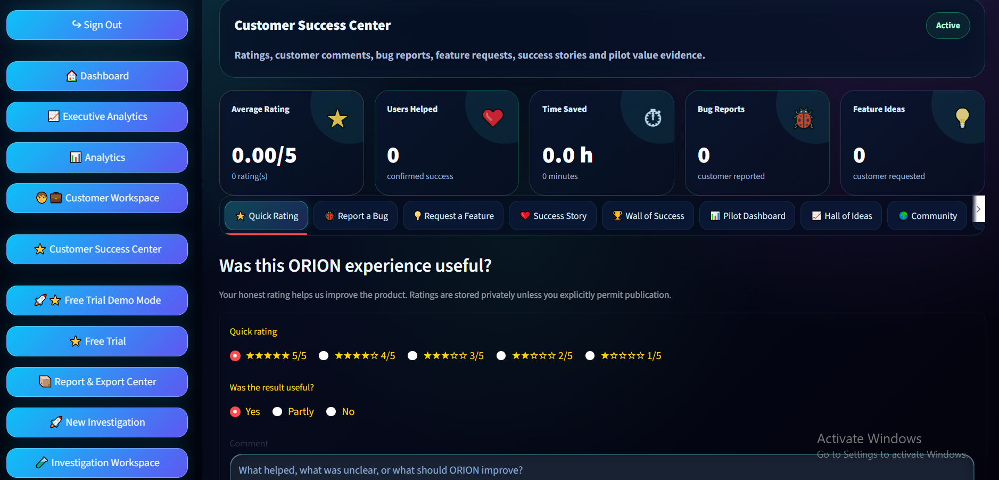

  

<h1 align="center">🧭 AETHERION ORION</h1>

<b>Executive AI Engineering Intelligence Platform</b>

Transform engineering evidence into confident executive decisions.

---

# 🚀 Overview

AETHERION ORION is an AI-powered engineering intelligence platform designed for software engineering leaders.

The platform transforms GitHub engineering evidence into executive insights, helping organizations investigate technical risks, evaluate release readiness, monitor engineering health and generate CTO-ready reports.

Unlike traditional AI assistants, ORION focuses on engineering governance, evidence-driven decision support and operational visibility.

---

# ✨ Core Capabilities

- 🧠 GitHub Intelligence
- 🔎 Investigation Workspace
- 📈 Executive Analytics
- ⭐ Customer Success Center
- 🚀 Free Trial Experience
- 📊 Portfolio Intelligence
- 🛡 Release Readiness
- ⚠ API Contract Risk
- 💾 Database Migration Risk
- 🧭 Executive Decision Support

---

# 📸 Platform Screenshots

## 🚀 Free Trial Experience

Guide engineering teams from GitHub connection to a CTO-ready report in minutes.

---

## 🧠 GitHub Intelligence

Secure read-only repository analysis powered by real GitHub engineering evidence.

---

## 🔎 Investigation Workspace

Analyze incidents, release risks, runtime investigations and engineering scenarios.

---

## 📈 Executive Analytics

Monitor engineering activity, operational insights and executive metrics.

---

## ⭐ Customer Success Center

Track customer feedback, feature requests, bug reports and measurable business value.

---

# 🎯 Designed For

- CTOs
- VP Engineering
- Engineering Managers
- Platform Teams
- DevOps Engineers
- Software Architects
- Enterprise Engineering Organizations

---

# 🔒 Security

AETHERION ORION connects to GitHub using a **read-only model**.

The platform never:

- modifies repositories
- pushes commits
- merges pull requests
- deletes branches
- changes source code

Engineering evidence remains under the control of the repository owner.

---

# 🚀 Pilot Program

We are currently welcoming pilot engineering teams interested in evaluating AETHERION ORION in real-world software engineering environments.

Feedback from pilot users directly shapes future platform capabilities.

---

# 🗺️ Roadmap

- ✅ Executive Analytics
- ✅ GitHub Intelligence
- ✅ Investigation Workspace
- ✅ Customer Success Center
- ✅ Free Trial Experience
- 🔄 Enterprise Workspace
- 🔄 Multi-Repository Intelligence
- 🔄 Enterprise API
- 🔄 Cloud Integrations

---

# 📬 Contact

Interested in a pilot, collaboration or partnership?

Follow the AETHERION ORION project on GitHub and LinkedIn for future updates.

---

<b>AETHERION ORION</b> 
Executive AI Engineering Intelligence Platform

